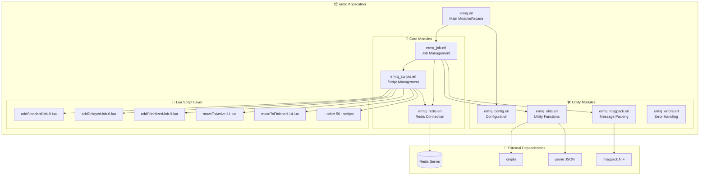
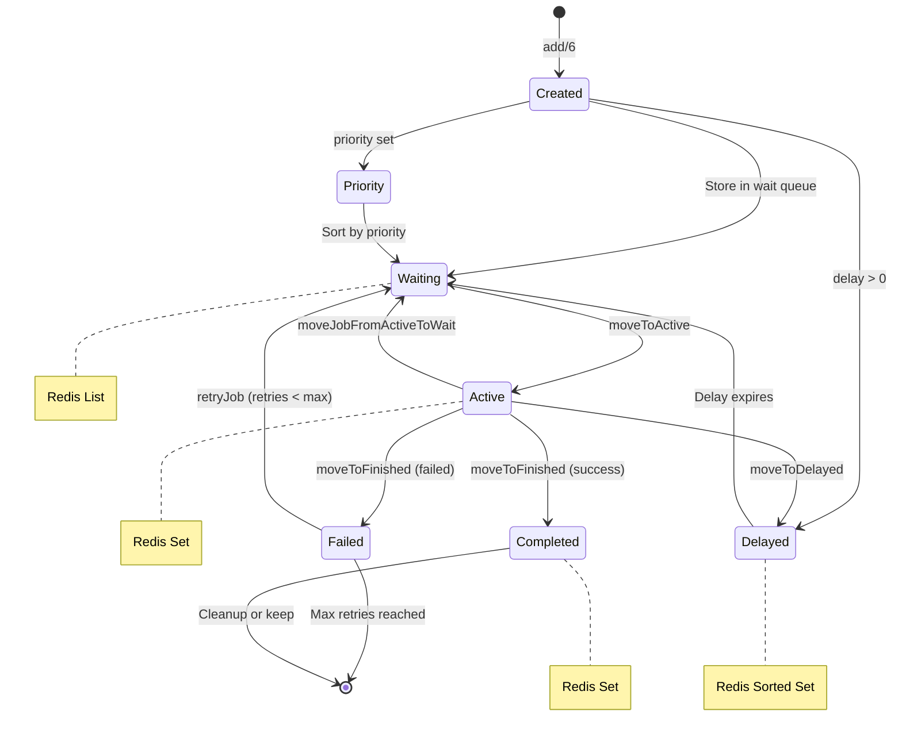

---

title: 📬 ermq Message Queue - The Art of Postal System

tags: [erlang, redis, message-queue, distributed, visualization]

aliases: [ermq, BullMQ, task-queue]

created: 2026-04-03

---

  

# 📬 ermq Message Queue - The Art of Postal System

  

> 📚 Deep dive into ermq's architecture design: How to build a distributed task queue with Erlang + Redis? How do modules collaborate? What role do Lua scripts play?

  

---

  

## 📖 Chapter 1: The Mission of Postal System

  

### Background: Why Need Message Queues?

  

In modern distributed systems, **asynchronous task processing** is a core requirement. Just like real-world postal systems:

  

```

┌─────────────────────────────────────────────────────────────────────────┐

│ 📬 Birth of Postal System │

├─────────────────────────────────────────────────────────────────────────┤

│ │

│ Problem Scenario: │

│ │

│ User Request ──▶ Server ──▶ Need to send email │

│ │ │ │

│ │ ▼ │

│ │ If sending synchronously: │

│ │ - User waits 10 seconds │

│ │ - Server blocked │

│ │ - Terrible experience! │

│ │ │

│ Solution: Message Queue │

│ │

│ User Request ──▶ Server ──▶ Drop at post office ──▶ Return immediately │

│ │ │ │

│ ▼ ▼ │

│ Post office processing... User continues other operations │

│ │ │

│ ▼ │

│ Email sent successfully! │

│ │

└─────────────────────────────────────────────────────────────────────────┘

  

ermq = Erlang Message Queue

Inspiration: Erlang implementation of BullMQ (Node.js)

  

┌─────────────────────────────────────────────────────────────────────────┐

│ │

│ BullMQ (Node.js) ermq (Erlang) │

│ ┌─────────────────────┐ ┌─────────────────────┐ │

│ │ JavaScript │ │ Erlang │ │

│ │ Single-thread event │ ───▶ │ Actor concurrency │ │

│ │ loop │ │ model │ │

│ │ Redis + Lua │ │ Redis + Lua │ │

│ └─────────────────────┘ └─────────────────────┘ │

│ │

│ Commonalities: │

│ ✅ Redis-based persistence │

│ ✅ Lua scripts ensure atomicity │

│ ✅ Support delayed tasks, priority, retry │

│ │

│ Differences: │

│ ⚡ Erlang natively supports high concurrency │

│ ⚡ OTP framework provides fault tolerance │

│ ⚡ More suitable for building highly available systems │

│ │

└─────────────────────────────────────────────────────────────────────────┘

```

  

### Vivid Metaphor: Busy Post Office

  

> [!TIP] 📬 Vivid Metaphor
>
> **ermq = A modern intelligent postal system**
>
> Imagine an ultra-efficient post office:
> - 📮 **Reception Window** (API): Receive user emails
> - 📦 **Sorting Center** (Job): Classify emails, mark priority
> - 🚀 **Conveyor Belt** (Redis): Quickly transport emails
> - 🤖 **Smart Robot** (Lua): Automatic sorting, delay handling
> - 📋 **Archive Room** (Persistence): Save all email records
> - ⏰ **Timer** (Delayed tasks): Deliver scheduled emails on time

  

```

┌─────────────────────────────────────────────────────────────────────────┐

│ 📬 Smart Post Office Panorama │

├─────────────────────────────────────────────────────────────────────────┤

│ │

│ ┌─────────────────────────────────────────────────────────────────┐ │

│ │ 🏢 Post Office Building (ermq Application) │ │

│ │ │ │

│ │ ┌──────────┐ ┌──────────┐ ┌──────────┐ │ │

│ │ │ Reception│ │ Customer │ │ Admin │ │ │

│ │ │ Window │ │ Service │ │ Backend │ │ │

│ │ │ (API) │ │ (Config) │ │(Monitor) │ │ │

│ │ └────┬─────┘ └────┬─────┘ └────┬─────┘ │ │

│ │ │ │ │ │ │

│ │ └──────────────┼──────────────┘ │ │

│ │ │ │ │

│ │ ▼ │ │

│ │ ┌──────────────────────────────────────────────────────┐ │ │

│ │ │ 📦 Sorting Hall (Job Processing) │ │ │

│ │ │ ┌────────┐ ┌────────┐ ┌────────┐ ┌────────┐ │ │ │

│ │ │ │ Normal │ │Express │ │Schedule│ │ Retry │ │ │ │

│ │ │ └───┬────┘ └───┬────┘ └───┬────┘ └───┬────┘ │ │ │

│ │ │ │ │ │ │ │ │

│ │ └────┼──────────┼──────────┼──────────┼──────────┘ │ │

│ │ │ │ │ │ │ │

│ │ ▼ ▼ ▼ ▼ │ │

│ │ ┌──────────────────────────────────────────────────────┐ │ │

│ │ │ 🚀 High-speed Conveyor Belt (Redis) │ │ │

│ │ │ ┌─────────────────────────────────────────────────┐ │ │ │

│ │ │ │ Lists │ Sets │ Sorted Sets │ Streams │ │ │ │

│ │ │ └─────────────────────────────────────────────────┘ │ │ │

│ │ └──────────────────────────────────────────────────────┘ │ │

│ │ │ │

│ │ ▼ │ │

│ │ ┌──────────────────────────────────────────────────────┐ │ │

│ │ │ 🤖 Smart Sorting Robots (Lua Scripts) │ │ │

│ │ │ ┌────────┐ ┌────────┐ ┌────────┐ ┌────────┐ │ │ │

│ │ │ │Atomicity│ │Priority│ │ Delay │ │ Retry │ │ │ │

│ │ │ └────────┘ └────────┘ └────────┘ └────────┘ │ │ │

│ │ └──────────────────────────────────────────────────────┘ │ │

│ │ │ │

│ └─────────────────────────────────────────────────────────────────┘ │

│ │

└─────────────────────────────────────────────────────────────────────────┘

```

  

---

  

## 🏗️ Chapter 2: Module Architecture Overview

  

### 2.1 Module Dependencies

  



  

### 2.2 Module Summary Table

  

| Module | Role | Metaphor | Core Responsibility |

|--------|------|----------|---------------------|

| `ermq.erl` | Facade | 🏢 Post Office Hall | External API, coordinate sub-modules |

| `ermq_job.erl` | Business Core | 📦 Sorting Center | Job creation, query, status management |

| `ermq_redis.erl` | Connection Layer | 🚀 Conveyor Control Room | Redis connection pool, command execution |

| `ermq_scripts.erl` | Script Engine | 🤖 Robot Dispatch Center | Lua script loading, caching, execution |

| `ermq_config.erl` | Configuration | ⚙️ Rules Room | Queue configuration, parameter management |

| `ermq_utils.erl` | Toolbox | 🔧 Maintenance Workshop | UUID, JSON, key building utilities |

| `ermq_msgpack.erl` | Encoder | 📝 Code Translator | Erlang ↔ MsgPack conversion |

| `ermq_errors.erl` | Error Codes | 📋 Exception Manual | Error code definition, error conversion |

  

---

  

## 📦 Chapter 3: Core Module Details

  

### 3.1 ermq_job.erl - Heart of Sorting Center

  

> [!TIP] 📦 Vivid Metaphor
>
> **ermq_job.erl = Email Sorting Center**
>
> This is the busiest place in the post office:
> - 📥 Receive new emails (create jobs)
> - 🏷️ Label and classify (set priority, delay)
> - 📊 Record status (waiting, processing, completed)
> - 🔍 Query email location (get job by ID)

  

```

┌─────────────────────────────────────────────────────────────────────────┐

│ 📦 Job Module - Sorting Center Workflow │

├─────────────────────────────────────────────────────────────────────────┤

│ │

│ API Interfaces: │

│ ┌─────────────────────────────────────────────────────────────────┐ │

│ │ add/5, add/6 Create new job (receive new email) │ │

│ │ from_id/4 Query job by ID (track email) │ │

│ │ update_progress/5 Update progress (update status) │ │

│ └─────────────────────────────────────────────────────────────────┘ │

│ │

│ Job Types: │

│ ┌─────────────────────────────────────────────────────────────────┐ │

│ │ │ │

│ │ ┌──────────────┐ ┌──────────────┐ ┌──────────────┐ │ │

│ │ │ 📮 Standard │ │ ⏰ Delayed │ │ ⚡ Priority │ │ │

│ │ │ Job │ │ Job │ │ Job │ │ │

│ │ │ │ │ │ │ │ │ │ │

│ │ │ Enter queue │ │ Enter queue │ │ Sort by │ │ │

│ │ │ immediately │ │ after N sec │ │ priority │ │ │

│ │ └──────────────┘ └──────────────┘ └──────────────┘ │ │

│ │ │ │ │ │ │ │

│ │ ┌──────────────┐ ┌──────────────┐ ┌──────────────┐ │ │

│ │ │ 🔄 Repeatable│ │ 👨‍👩‍👧 Parent │ │ 📅 Scheduler │ │ │

│ │ │ Job │ │ Job │ │ Job │ │ │

│ │ │ │ │ │ │ │ │ │ │

│ │ │ Periodic │ │ Dependency │ │ Cron │ │ │

│ │ │ execution │ │ management │ │ expression │ │ │

│ │ └──────────────┘ └──────────────┘ └──────────────┘ │ │

│ │ │ │

│ └─────────────────────────────────────────────────────────────────┘ │

│ │

│ Job Lifecycle: │

│ ┌─────────────────────────────────────────────────────────────────┐ │

│ │ │ │

│ │ Waiting ──▶ Active ──▶ Completed │ │

│ │ (wait) (active) (completed) │ │

│ │ │ │ │ │

│ │ │ ├──▶ Failed (failed) │ │

│ │ │ │ │ │

│ │ │ └──▶ Delayed (delayed) │ │

│ │ │ │ │

│ │ ▼ │ │

│ │ Waiting for Retry │ │

│ │ (retry) │ │

│ │ │ │

│ └─────────────────────────────────────────────────────────────────┘ │

│ │

└─────────────────────────────────────────────────────────────────────────┘

```

  

**Core Code Structure:**

```erlang

%% 📍 src/ermq_job.erl

-module(ermq_job).

%% API

-export([

    add/5, add/6,           %% Create job

    from_id/4,              %% Query job

    update_progress/5       %% Update progress

]).

%% Internal functions

-export([

    prepare_add_script/9    %% Prepare add script

]).

%% Job creation flow

add(Client, Prefix, QueueName, Name, Data, Opts) ->

    %% 1. Merge default options

    JobOpts = maps:merge(?DEFAULT_JOB_OPTS, Opts),

    

    %% 2. Generate or use custom JobId

    JobId = generate_job_id(JobOpts),

    

    %% 3. JSON encode data

    JsonData = ermq_utils:json_encode(Data),

    

    %% 4. MsgPack pack options

    PackedOpts = ermq_msgpack:pack(JobOpts),

    

    %% 5. Select appropriate Lua script

    {ScriptName, Keys, Args} = prepare_add_script(

        Prefix, QueueName, JobId, Name, 

        Timestamp, Delay, Priority, PackedOpts, JsonData

    ),

    

    %% 6. Execute Lua script (atomic operation)

    ermq_scripts:run(Client, ScriptName, Keys, Args).

```

  

### 3.2 ermq_redis.erl - Conveyor Control Room

  

> [!TIP] 🚀 Vivid Metaphor
>
> **ermq_redis.erl = Conveyor Control Room**
>
> Responsibilities:
> - 🔌 **Connection Management**: Maintain Redis connection pool
> - 📡 **Command Transmission**: Send commands to Redis
> - 🔄 **Connection Reuse**: Efficiently utilize connection resources
> - 💓 **Health Check**: Ensure connections are available

  

```

┌─────────────────────────────────────────────────────────────────────────┐

│ 🚀 Redis Module - Conveyor Control System │

├─────────────────────────────────────────────────────────────────────────┤

│ │

│ Architecture Design: │

│ ┌─────────────────────────────────────────────────────────────────┐ │

│ │ │ │

│ │ ┌──────────┐ │ │

│ │ │ App Layer│ │ │

│ │ │ (ermq) │ │ │

│ │ └────┬─────┘ │ │

│ │ │ │ │

│ │ ▼ │ │

│ │ ┌──────────────────────────────────────────────────────────┐ │ │

│ │ │ Connection Pool │ │ │

│ │ │ ┌────────┐ ┌────────┐ ┌────────┐ ┌────────┐ │ │ │

│ │ │ │ Conn 1 │ │ Conn 2 │ │ Conn 3 │ │ Conn N │ │ │ │

│ │ │ └───┬────┘ └───┬────┘ └───┬────┘ └───┬────┘ │ │ │

│ │ │ │ │ │ │ │ │ │

│ │ └────┼──────────┼──────────┼──────────┼──────────┘ │ │

│ │ │ │ │ │ │ │

│ │ └──────────┴──────────┴──────────┴──────────┘ │ │

│ │ │ │

│ │ ▼ │ │

│ │ ┌──────────────────────────────────────────────────────────┐ │ │

│ │ │ 🔴 Redis Server │ │ │

│ │ │ ┌─────────────────────────────────────────────────────┐ │ │ │

│ │ │ │ Lists │ Sets │ ZSets │ Streams │ │ │ │

│ │ │ └─────────────────────────────────────────────────────┘ │ │ │

│ │ └──────────────────────────────────────────────────────────┘ │ │

│ │ │ │

│ └─────────────────────────────────────────────────────────────────┘ │

│ │

│ Core Operations: │

│ ┌─────────────────────────────────────────────────────────────────┐ │

│ │ q/2 Execute single Redis command │ │

│ │ qp/2 Batch execute Redis commands (Pipeline) │ │

│ │ transaction/2 Execute Redis transaction (MULTI/EXEC) │ │

│ └─────────────────────────────────────────────────────────────────┘ │

│ │

└─────────────────────────────────────────────────────────────────────────┘

```

  

**Core Code Structure:**

```erlang

%% 📍 src/ermq_redis.erl

-module(ermq_redis).

-behaviour(gen_server).

%% API

-export([

    start_link/1,    %% Start connection

    stop/1,          %% Stop connection

    q/2,             %% Execute single command

    qp/2,            %% Pipeline batch execution

    transaction/2    %% Transaction execution

]).

%% gen_server callbacks

-export([init/1, handle_call/3, handle_cast/2, handle_info/2]).

%% Execute Redis command

q(Client, Command) ->

    gen_server:call(Client, {execute, Command}).

%% Pipeline batch execution

qp(Client, Commands) ->

    gen_server:call(Client, {pipeline, Commands}).

%% Transaction execution

transaction(Client, Fun) ->

    gen_server:call(Client, {transaction, Fun}).

```

  

### 3.3 ermq_scripts.erl - Robot Dispatch Center

  

> [!TIP] 🤖 Vivid Metaphor
>
> **ermq_scripts.erl = Smart Robot Dispatch Center**
>
> Manages all automation robots (Lua scripts):
> - 📥 **Script Loading**: Read scripts from filesystem
> - 💾 **Script Caching**: Cache compiled SHA
> - 🎯 **Script Execution**: Dispatch robots to execute tasks
> - 🔄 **Script Refresh**: Detect script updates

  

```

┌─────────────────────────────────────────────────────────────────────────┐

│ 🤖 Scripts Module - Robot Dispatch System │

├─────────────────────────────────────────────────────────────────────────┤

│ │

│ Workflow: │

│ ┌─────────────────────────────────────────────────────────────────┐ │

│ │ │ │

│ │ 1. Initialization Phase │ │

│ │ ┌───────────────────────────────────────────────────────────┐ │ │

│ │ │ init() │ │ │

│ │ │ │ │ │

│ │ │ Scan priv/lua/ directory │ │ │

│ │ │ ▼ │ │ │

│ │ │ Load all .lua scripts │ │ │

│ │ │ ▼ │ │ │

│ │ │ Calculate SHA1 hash │ │ │

│ │ │ ▼ │ │ │

│ │ │ Cache to ETS table │ │ │

│ │ └───────────────────────────────────────────────────────────┘ │ │

│ │ │ │

│ │ 2. Execution Phase │ │

│ │ ┌───────────────────────────────────────────────────────────┐ │ │

│ │ │ run(ScriptName, Keys, Args) │ │ │

│ │ │ │ │ │

│ │ │ ┌─────────────────┐ │ │ │

│ │ │ │ Find SHA cache │ │ │ │

│ │ │ └────────┬────────┘ │ │ │

│ │ │ │ │ │

│ │ │ ▼ │ │ │

│ │ │ ┌─────────────────┐ ┌─────────────────┐ │ │ │

│ │ │ │ Cache hit? │ │ Cache miss │ │ │ │

│ │ │ │ EVALSHA execute │ │ LOAD + EVALSHA │ │ │ │

│ │ │ └────────┬────────┘ └────────┬────────┘ │ │ │

│ │ │ │ │ │ │ │

│ │ │ └──────────┬──────────────┘ │ │ │

│ │ │ │ │ │

│ │ │ ▼ │ │ │

│ │ │ ┌─────────────────┐ │ │ │

│ │ │ │ Return result │ │ │ │

│ │ │ └─────────────────┘ │ │ │

│ │ └───────────────────────────────────────────────────────────┘ │ │

│ │ │ │

│ └─────────────────────────────────────────────────────────────────┘ │

│ │

│ Script Categories: │

│ ┌─────────────────────────────────────────────────────────────────┐ │

│ │ │ │

│ │ 📮 Job Creation 🔄 State Transition 📊 Query 🧹 Cleanup │ │

│ │ ┌─────────────┐ ┌─────────────┐ ┌─────────────┐ ┌─────────────┐│ │

│ │ │addStandard │ │moveToActive │ │getCounts │ │removeJob ││ │

│ │ │addDelayed │ │moveToFinished│ │getState │ │cleanJobs ││ │

│ │ │addPrioritized│ │moveToWait │ │getRanges │ │obliterate ││ │

│ │ │addRepeatable │ │retryJob │ │paginate │ │drain ││ │

│ │ └─────────────┘ └─────────────┘ └─────────────┘ └─────────────┘│ │

│ │ │ │

│ └─────────────────────────────────────────────────────────────────┘ │

│ │

└─────────────────────────────────────────────────────────────────────────┘

```

  

**Core Code Structure:**

```erlang

%% 📍 src/ermq_scripts.erl

-module(ermq_scripts).

%% API

-export([

    init/0,              %% Initialize script cache

    init/1,              %% Initialize with specified directory

    run/4,               %% Execute script

    load_command/2,      %% Load single script

    get_sha/1            %% Get script SHA

]).

%% Initialize script cache

init() ->

    %% Create ETS table to store SHA

    ets:new(?SCRIPT_TABLE, [named_table, set, public]),

    %% Get priv/lua directory

    LuaDir = code:priv_dir(ermq) ++ "/lua",

    %% Load all scripts

    load_scripts_from_dir(LuaDir).

%% Execute Lua script

run(Client, ScriptName, Keys, Args) ->

    case get_sha(ScriptName) of

        {ok, Sha} ->

            %% Try EVALSHA first (fast path)

            case ermq_redis:q(Client, ["EVALSHA", Sha | Keys ++ Args]) of

                {error, <<"NOSCRIPT", _/binary>>} ->

                    %% SHA not loaded, use EVAL

                    Script = get_script_content(ScriptName),

                    ermq_redis:q(Client, ["EVAL", Script | Keys ++ Args]);

                Result ->

                    Result

            end;

        {error, not_found} ->

            {error, script_not_found}

    end.

```

  

---

  

## 🛠️ Chapter 4: Utility Module Details

  

### 4.1 ermq_utils.erl - Maintenance Workshop

  

> [!TIP] 🔧 Vivid Metaphor
>
> **ermq_utils.erl = Post Office Maintenance Workshop**
>
> Stores various common tools:
> - 🔑 **UUID Generator**: Generate unique email numbers
> - 🔗 **Key Builder**: Build Redis key names
> - 📝 **JSON Encode/Decode**: Handle data formats
> - 🔄 **Type Conversion**: Various data type conversions

  

```

┌─────────────────────────────────────────────────────────────────────────┐

│ 🔧 Utils Module - Toolbox │

├─────────────────────────────────────────────────────────────────────────┤

│ │

│ Tool List: │

│ ┌─────────────────────────────────────────────────────────────────┐ │

│ │ │ │

│ │ 🔑 UUID Generation │ │

│ │ ┌───────────────────────────────────────────────────────────┐ │ │

│ │ │ v4() -> binary() │ │ │

│ │ │ │ │ │

│ │ │ Generate UUID v4 format unique identifier │ │ │

│ │ │ Example: <<"550e8400-e29b-41d4-a716-446655440000">> │ │ │

│ │ └───────────────────────────────────────────────────────────┘ │ │

│ │ │ │

│ │ 🔗 Key Building │ │

│ │ ┌───────────────────────────────────────────────────────────┐ │ │

│ │ │ to_key(Prefix, Parts) -> binary() │ │ │

│ │ │ │ │ │

│ │ │ Build Redis key: Prefix:Part1:Part2:... │ │ │

│ │ │ Example: to_key(<<"ermq">>, [<<"queue">>, <<"wait">>]) │ │ │

│ │ │ Result: <<"ermq:queue:wait">> │ │ │

│ │ └───────────────────────────────────────────────────────────┘ │ │

│ │ │ │

│ │ 📝 JSON Processing │ │

│ │ ┌───────────────────────────────────────────────────────────┐ │ │

│ │ │ json_encode(Term) -> binary() │ │ │

│ │ │ json_decode(Binary) -> map() │ │ │

│ │ │ │ │ │

│ │ │ Erlang data ↔ JSON string │ │ │

│ │ └───────────────────────────────────────────────────────────┘ │ │

│ │ │ │

│ │ 🔄 Type Conversion │ │

│ │ ┌───────────────────────────────────────────────────────────┐ │ │

│ │ │ to_binary(term()) -> binary() │ │ │

│ │ │ │ │ │

│ │ │ Convert any type to binary (Redis compatible) │ │ │

│ │ │ Supports: binary, list, integer, float, atom │ │ │

│ │ └───────────────────────────────────────────────────────────┘ │ │

│ │ │ │

│ └─────────────────────────────────────────────────────────────────┘ │

│ │

└─────────────────────────────────────────────────────────────────────────┘

```

  

### 4.2 ermq_msgpack.erl - Code Translator

  

> [!TIP] 📝 Vivid Metaphor
>
> **ermq_msgpack.erl = Code Translator**
>
> Responsible for translating data between Erlang and Lua:
> - 📦 **Pack**: Erlang terms → MsgPack binary
> - 📤 **Unpack**: MsgPack binary → Erlang terms
> - 🔄 **Format Preservation**: Keep data type information

  

```

┌─────────────────────────────────────────────────────────────────────────┐

│ 📝 MsgPack Module - Data Translator │

├─────────────────────────────────────────────────────────────────────────┤

│ │

│ Why MsgPack? │

│ ┌─────────────────────────────────────────────────────────────────┐ │

│ │ │ │

│ │ Problem: Erlang ↔ Lua data type incompatibility │ │

│ │ │ │

│ │ Erlang Lua │ │

│ │ ┌─────────────────┐ ┌─────────────────┐ │ │

│ │ │ atom (hello) │ │ string │ │ │

│ │ │ binary (<<"a">>)│ │ string │ │ │

│ │ │ list ([1,2,3]) │ │ table (array) │ │ │

│ │ │ map (#{a=>1}) │ │ table (hash) │ │ │

│ │ │ integer │ │ number │ │ │

│ │ │ undefined │ │ nil │ │ │

│ │ └─────────────────┘ └─────────────────┘ │ │

│ │ │ │

│ │ Solution: MsgPack (binary serialization format) │ │

│ │ │ │

│ │ Erlang ──▶ pack ──▶ MsgPack ──▶ Lua (cmsgpack.unpack) │ │

│ │ Lua ──▶ cmsgpack.pack ──▶ MsgPack ──▶ unpack ──▶ Erlang │ │

│ │ │ │

│ └─────────────────────────────────────────────────────────────────┘ │

│ │

│ Conversion Example: │

│ ┌─────────────────────────────────────────────────────────────────┐ │

│ │ │ │

│ │ Erlang Term MsgPack Binary │ │

│ │ ───────────────────────────────────────────── │ │

│ │ true <<0xC3>> │ │

│ │ false <<0xC2>> │ │

│ │ nil <<0xC0>> │ │

│ │ 42 <<0x2A>> │ │

│ │ <<"hello">> <<0xA5, "hello">> │ │

│ │ #{<<"a">> => 1} <<0x81, 0xA1, "a", 0x01>> │ │

│ │ [1, 2, 3] <<0x93, 0x01, 0x02, 0x03>> │ │

│ │ │ │

│ └─────────────────────────────────────────────────────────────────┘ │

│ │

└─────────────────────────────────────────────────────────────────────────┘

```

  

### 4.3 ermq_config.erl - Rules Room

  

> [!TIP] ⚙️ Vivid Metaphor
>
> **ermq_config.erl = Post Office Rules Room**
>
> Stores all operational rules:
> - 📋 **Queue Configuration**: Default timeout, retry count
> - 🔧 **Connection Configuration**: Redis address, connection pool size
> - ⏱️ **Time Configuration**: Delay precision, timeout settings

  

```

┌─────────────────────────────────────────────────────────────────────────┐

│ ⚙️ Config Module - Configuration Management Center │

├─────────────────────────────────────────────────────────────────────────┤

│ │

│ Configuration Hierarchy: │

│ ┌─────────────────────────────────────────────────────────────────┐ │

│ │ │ │

│ │ ┌───────────────────────────────────────────────────────────┐ │ │

│ │ │ Application Config (app.config) │ │ │

│ │ │ ┌─────────────────────────────────────────────────────┐ │ │ │

│ │ │ │ ermq: [ │ │ │ │

│ │ │ │ {redis_host, "localhost"}, │ │ │ │

│ │ │ │ {redis_port, 6379}, │ │ │ │

│ │ │ │ {pool_size, 10} │ │ │ │

│ │ │ │ ] │ │ │ │

│ │ │ └─────────────────────────────────────────────────────┘ │ │ │

│ │ └───────────────────────────────────────────────────────────┘ │ │

│ │ │ │

│ │ ▼ │ │

│ │ ┌───────────────────────────────────────────────────────────┐ │ │

│ │ │ Queue Default Configuration │ │ │

│ │ │ ┌─────────────────────────────────────────────────────┐ │ │ │

│ │ │ │ #{ │ │ │ │

│ │ │ │ attempts => 3, % Default retry count │ │ │ │

│ │ │ │ timeout => 30000, % Default timeout (ms) │ │ │ │

│ │ │ │ delay => 0, % Default delay │ │ │ │

│ │ │ │ priority => normal % Default priority │ │ │ │

│ │ │ │ } │ │ │ │

│ │ │ └─────────────────────────────────────────────────────┘ │ │ │

│ │ └───────────────────────────────────────────────────────────┘ │ │

│ │ │ │

│ └─────────────────────────────────────────────────────────────────┘ │

│ │

└─────────────────────────────────────────────────────────────────────────┘

```

  

---

  

## 📜 Chapter 5: Lua Script Layer - Smart Robot Legion

  

### 5.1 Lua Script Purpose

  

> [!IMPORTANT] 🤖 Why Use Lua Scripts?
>
> Redis is single-threaded, race conditions may exist between multiple commands.
>
> **Lua Scripts = Atomic Operations**
>
> A Lua script is executed atomically in Redis, not interrupted by other commands.

  

```

┌─────────────────────────────────────────────────────────────────────────┐

│ 📜 Lua Scripts - Magic of Atomic Operations │

├─────────────────────────────────────────────────────────────────────────┤

│ │

│ Problem Scenario (without Lua): │

│ ┌─────────────────────────────────────────────────────────────────┐ │

│ │ │ │

│ │ Client A Client B │ │

│ │ │ │

│ │ 1. GET counter ───────────────────────────────────▶ │ │

│ │ Returns 5 │ │

│ │ │ 1. GET counter ────────────────────▶ │ │

│ │ │ Returns 5 │ │

│ │ 2. SET counter 6 ─────────────────────────────────▶ │ │

│ │ │ 2. SET counter 6 ───────────────────▶ │ │

│ │ │ │ │

│ │ Result: counter = 6 (should be 7!) │ │

│ │ Reason: Race condition between GET and SET │ │

│ │ │ │

│ └─────────────────────────────────────────────────────────────────┘ │

│ │

│ Solution (using Lua): │

│ ┌─────────────────────────────────────────────────────────────────┐ │

│ │ │ │

│ │ Client A Client B │ │

│ │ │ │

│ │ 1. EVAL "redis.call('INCR','counter')" ──────────▶ │ │

│ │ Atomic execution: GET + SET │ │

│ │ Returns 6 │ │

│ │ │ 1. EVAL "redis.call('INCR','counter')" │ │ │

│ │ │ Waiting for A to complete... │ │ │

│ │ │ │ │ │

│ │ │ Executes, returns 7 │ │ │

│ │ │ │ │

│ │ Result: counter = 7 ✅ │ │

│ │ Reason: Lua script executes atomically │ │

│ │ │ │

│ └─────────────────────────────────────────────────────────────────┘ │

│ │

└─────────────────────────────────────────────────────────────────────────┘

```

  

### 5.2 Script Categories and Functions

  

```

┌─────────────────────────────────────────────────────────────────────────┐

│ 📜 Lua Script Legion - 50+ Smart Robots │

├─────────────────────────────────────────────────────────────────────────┤

│ │

│ ┌─────────────────────────────────────────────────────────────────┐ │

│ │ 📮 Job Creation (6 scripts) │ │

│ │ ┌───────────────────────────────────────────────────────────┐ │ │

│ │ │ addStandardJob-9.lua Standard job │ │ │

│ │ │ addDelayedJob-6.lua Delayed job │ │ │

│ │ │ addPrioritizedJob-9.lua Priority job │ │ │

│ │ │ addRepeatableJob-2.lua Repeatable job │ │ │

│ │ │ addParentJob-6.lua Parent job │ │ │

│ │ │ addJobScheduler-11.lua Scheduled job │ │ │

│ │ └───────────────────────────────────────────────────────────┘ │ │

│ └─────────────────────────────────────────────────────────────────┘ │

│ │

│ ┌─────────────────────────────────────────────────────────────────┐ │

│ │ 🔄 State Transition (8 scripts) │ │

│ │ ┌───────────────────────────────────────────────────────────┐ │ │

│ │ │ moveToActive-11.lua Waiting → Active │ │ │

│ │ │ moveToFinished-14.lua Active → Completed/Failed │ │ │

│ │ │ moveToDelayed-8.lua Active → Delayed │ │ │

│ │ │ moveToWaitingChildren-7.lua Waiting for subtasks │ │ │

│ │ │ moveJobFromActiveToWait-9.lua Active → Waiting │ │ │

│ │ │ moveJobsToWait-8.lua Batch return to waiting │ │ │

│ │ │ moveStalledJobsToWait-8.lua Handle stalled jobs │ │ │

│ │ │ retryJob-11.lua Retry failed job │ │ │

│ │ └───────────────────────────────────────────────────────────┘ │ │

│ └─────────────────────────────────────────────────────────────────┘ │

│ │

│ ┌─────────────────────────────────────────────────────────────────┐ │

│ │ 📊 Query (10+ scripts) │ │

│ │ ┌───────────────────────────────────────────────────────────┐ │ │

│ │ │ getCounts-1.lua Get status counts │ │ │

│ │ │ getState-8.lua Get job state │ │ │

│ │ │ getRanges-1.lua Get range data │ │ │

│ │ │ getMetrics-2.lua Get metrics │ │ │

│ │ │ getJobScheduler-1.lua Get scheduled job │ │ │

│ │ │ isFinished-3.lua Check if completed │ │ │

│ │ │ isJobInList-1.lua Check if in list │ │ │

│ │ │ isMaxed-2.lua Check if at limit │ │ │

│ │ │ paginate-1.lua Paginated query │ │ │

│ │ └───────────────────────────────────────────────────────────┘ │ │

│ └─────────────────────────────────────────────────────────────────┘ │

│ │

│ ┌─────────────────────────────────────────────────────────────────┐ │

│ │ 🧹 Cleanup/Management (10+ scripts) │ │

│ │ ┌───────────────────────────────────────────────────────────┐ │ │

│ │ │ removeJob-2.lua Delete job │ │ │

│ │ │ cleanJobsInSet-3.lua Clean jobs in set │ │ │

│ │ │ obliterate-2.lua Completely delete queue │ │ │

│ │ │ drain-5.lua Drain queue │ │ │

│ │ │ pause-7.lua Pause queue │ │ │

│ │ │ promote-9.lua Promote delayed job │ │ │

│ │ │ extendLock-2.lua Extend lock time │ │ │

│ │ │ releaseLock-1.lua Release lock │ │ │

│ │ └───────────────────────────────────────────────────────────┘ │ │

│ └─────────────────────────────────────────────────────────────────┘ │

│ │

└─────────────────────────────────────────────────────────────────────────┘

```

  

### 5.3 Script Analysis: addStandardJob-9.lua

  

```

┌─────────────────────────────────────────────────────────────────────────┐

│ 📜 addStandardJob-9.lua - Standard Job Addition Robot │

├─────────────────────────────────────────────────────────────────────────┤

│ │

│ Input Parameters: │

│ ┌─────────────────────────────────────────────────────────────────┐ │

│ │ KEYS (9 Redis keys) │ │

│ │ ┌───────────────────────────────────────────────────────────┐ │ │

│ │ │ KEYS[1] wait Waiting queue │ │ │

│ │ │ KEYS[2] paused Paused queue │ │ │

│ │ │ KEYS[3] meta Metadata │ │ │

│ │ │ KEYS[4] id ID counter │ │ │

│ │ │ KEYS[5] completed Completed set │ │ │

│ │ │ KEYS[6] delayed Delayed set │ │ │

│ │ │ KEYS[7] active Active set │ │ │

│ │ │ KEYS[8] events Event stream │ │ │

│ │ │ KEYS[9] marker Marker │ │ │

│ │ └───────────────────────────────────────────────────────────┘ │ │

│ │ │ │

│ │ ARGV (3 parameters) │ │

│ │ ┌───────────────────────────────────────────────────────────┐ │ │

│ │ │ ARGV[1] msgpack encoded parameter array │ │ │

│ │ │ ARGV[2] JSON encoded job data │ │ │

│ │ │ ARGV[3] msgpack encoded job options │ │ │

│ │ └───────────────────────────────────────────────────────────┘ │ │

│ └─────────────────────────────────────────────────────────────────┘ │

│ │

│ Execution Flow: │

│ ┌─────────────────────────────────────────────────────────────────┐ │

│ │ │ │

│ │ 1. Unpack parameters │ │

│ │ ├─ cmsgpack.unpack(ARGV[1]) → prefix, jobId, name, timestamp │ │

│ │ └─ cmsgpack.unpack(ARGV[3]) → options (attempts, delay, etc) │ │

│ │ │ │

│ │ 2. Check deduplication │ │

│ │ ├─ If deduplication key is set │ │

│ │ └─ Check if identical job already exists │ │

│ │ │ │

│ │ 3. Generate JobId │ │

│ │ ├─ If not specified, use INCR to generate auto-increment ID │ │

│ │ └─ If specified, use custom ID │ │

│ │ │ │

│ │ 4. Store job data │ │

│ │ └─ HMSET jobIdKey name data opts timestamp ... │ │

│ │ │ │

│ │ 5. Add to waiting queue │ │

│ │ ├─ If queue is paused: LPUSH paused jobId │ │

│ │ └─ If queue is normal: LPUSH wait jobId │ │

│ │ │ │

│ │ 6. Send event notification │ │

│ │ └─ XADD events * event waiting jobId jobId │ │

│ │ │ │

│ │ 7. Return JobId │ │

│ │ │ │

│ └─────────────────────────────────────────────────────────────────┘ │

│ │

└─────────────────────────────────────────────────────────────────────────┘

```

  

---

  

## 🔄 Chapter 6: Data Flow Panorama

  

### 6.1 Job Lifecycle

  



  

### 6.2 Complete Data Flow

  

```

┌─────────────────────────────────────────────────────────────────────────┐

│ 🔄 Job Data Flow Panorama │

├─────────────────────────────────────────────────────────────────────────┤

│ │

│ User Code │

│ ┌─────────────────────────────────────────────────────────────────┐ │

│ │ ermq_job:add(Client, Prefix, Queue, Name, Data, Opts) │ │

│ └───────────────────────────┬─────────────────────────────────────┘ │

│ │ │

│ ▼ │

│ ┌─────────────────────────────────────────────────────────────────┐ │

│ │ ermq_job.erl │ │

│ │ │ │

│ │ 1. Generate JobId (UUID or auto-increment) │ │

│ │ 2. JSON encode Data │ │

│ │ 3. MsgPack pack Opts │ │

│ │ 4. Select Lua script │ │

│ │ 5. Build Redis Keys │ │

│ └───────────────────────────┬─────────────────────────────────────┘ │

│ │ │

│ ▼ │

│ ┌─────────────────────────────────────────────────────────────────┐ │

│ │ ermq_scripts:run(Client, ScriptName, Keys, Args) │ │

│ │ │ │

│ │ 1. Get SHA from ETS cache │ │

│ │ 2. Execute EVALSHA (or EVAL) │ │

│ └───────────────────────────┬─────────────────────────────────────┘ │

│ │ │

│ ▼ │

│ ┌─────────────────────────────────────────────────────────────────┐ │

│ │ ermq_redis:q(Client, Command) │ │

│ │ │ │

│ │ Send command to Redis via connection pool │ │

│ └───────────────────────────┬─────────────────────────────────────┘ │

│ │ │

│ ▼ │

│ ┌─────────────────────────────────────────────────────────────────┐ │

│ │ 🔴 Redis Server │ │

│ │ │ │

│ │ ┌─────────────────────────────────────────────────────────────┐ │ │

│ │ │ Execute Lua script (atomic operation) │ │ │

│ │ │ │ │ │

│ │ │ 1. HSET job:123 name "send_email" data "{...}" │ │ │

│ │ │ 2. LPUSH queue:wait "123" │ │ │

│ │ │ 3. XADD queue:events * event waiting jobId "123" │ │ │

│ │ │ │ │ │

│ │ │ Return: "123" (JobId) │ │ │

│ │ └─────────────────────────────────────────────────────────────┘ │ │

│ │ │ │

│ │ Storage Structure: │ │

│ │ ┌─────────────────────────────────────────────────────────────┐ │ │

│ │ │ Hash: prefix:queue:jobId → {name, data, opts, status} │ │ │

│ │ │ List: prefix:queue:wait → [jobId1, jobId2, ...] │ │ │

│ │ │ Set: prefix:queue:active → {jobId1, jobId2, ...} │ │ │

│ │ │ ZSet: prefix:queue:delayed → {jobId: score} │ │ │

│ │ │ Stream: prefix:queue:events → {event, jobId, ...} │ │ │

│ │ └─────────────────────────────────────────────────────────────┘ │ │

│ │ │ │

│ └─────────────────────────────────────────────────────────────────┘ │

│ │

└─────────────────────────────────────────────────────────────────────────┘

```

  

---

  

## 📊 Appendix: Technical Summary

  

### Redis Data Structure Usage

  

| Data Structure | Key Pattern | Purpose |

|----------------|-------------|---------|

| Hash | `prefix:queue:jobId` | Store job details |

| List | `prefix:queue:wait` | Waiting queue (FIFO/LIFO) |

| Set | `prefix:queue:active` | Active job set |

| Sorted Set | `prefix:queue:delayed` | Delayed jobs (sorted by time) |

| Sorted Set | `prefix:queue:priority` | Priority jobs (sorted by score) |

| Stream | `prefix:queue:events` | Event stream (notify consumers) |

| String | `prefix:queue:id` | Auto-increment ID counter |

| Hash | `prefix:queue:meta` | Queue metadata |

  

### Module Responsibility Summary

  

| Module | Core Responsibility | Key Functions |

|--------|---------------------|---------------|

| ermq.erl | Facade API | start, stop, add_job |

| ermq_job.erl | Job Management | add, from_id, update_progress |

| ermq_redis.erl | Redis Connection | q, qp, transaction |

| ermq_scripts.erl | Lua Scripts | init, run, load_command |

| ermq_utils.erl | Utility Functions | v4, to_key, json_encode |

| ermq_msgpack.erl | Message Packing | pack, unpack |

| ermq_config.erl | Configuration | get, set |

| ermq_errors.erl | Error Handling | format_error |

  

### Lua Script Statistics

  

| Category | Count | Examples |

|----------|-------|----------|

| Job Creation | 6 | addStandardJob, addDelayedJob |

| State Transition | 8 | moveToActive, moveToFinished |

| Query | 10+ | getCounts, getState, paginate |

| Cleanup | 10+ | removeJob, cleanJobs, pause |

| Other | 20+ | extendLock, promote, retry |

| **Total** | **50+** | - |

  

---

  

> [!META] Document Info
> - Created: 2026-04-03
> - Difficulty: ⭐⭐⭐ (Distributed systems, Redis, Lua)
> - Related code: `src/*.erl`, `priv/lua/*.lua`
> - Core ideas: Postal metaphor, modular design, atomic operations

  

---

  

*📬 ermq —— Smart postal system built with Erlang!*