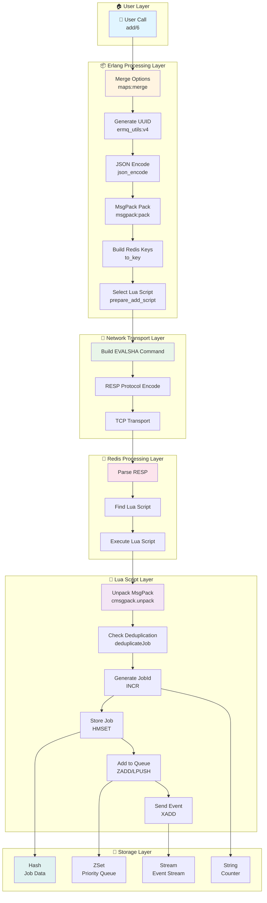
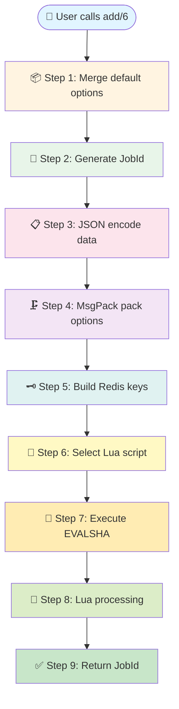
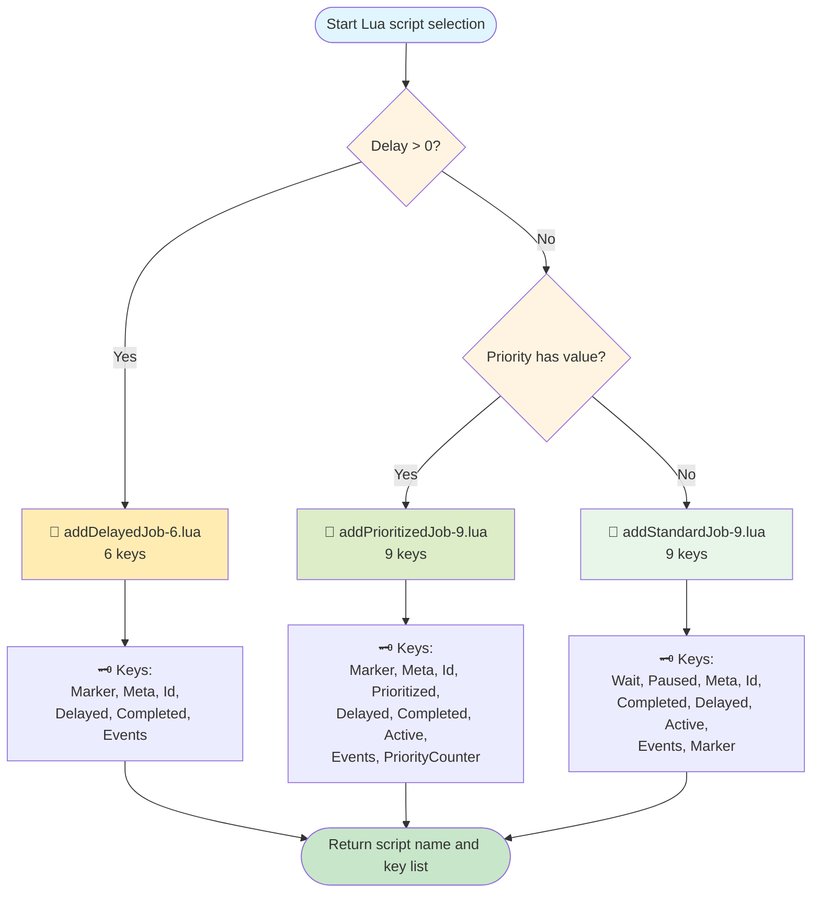
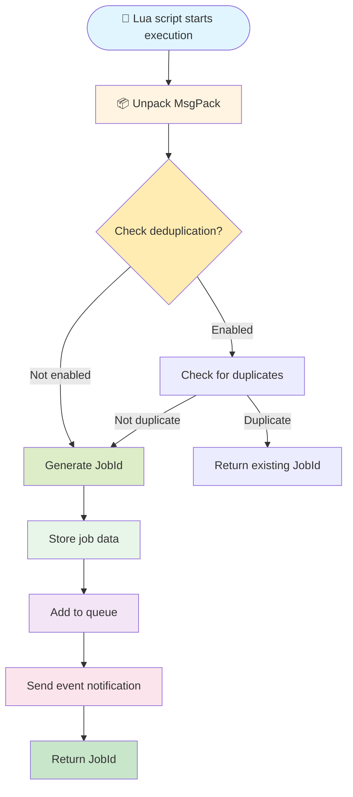

---

title: 🔄 ermq_job Data Flow Deep Dive - A Journey from Erlang to Redis

tags: [erlang, lua, redis, data-flow, deep-dive, visualization]

aliases: [data-flow, job-lifecycle, redis-operations, data-transformation]

created: 2026-04-03

---

  

# 🔄 ermq_job Data Flow Deep Dive - A Journey from Erlang to Redis

  

> 📚 Deep dive into every data transformation in ermq_job.erl: Erlang terms → MsgPack → Lua → Redis, how does data flow through this pipeline?

  

---

  

## 🎬 Opening: The Data Transformation Story

  

### One-line Summary

  

```

┌─────────────────────────────────────────────────────────────────────────┐

│ 🎯 Core Concept                                                        │

├─────────────────────────────────────────────────────────────────────────┤

│                                                                        │

│   What users see as add:                                               │

│   ┌─────────────────────────────────────────────────────────────┐      │

│   │ ermq_job:add(Client, Queue, Name, Data, Opts)              │      │

│   └─────────────────────────────────────────────────────────────┘      │

│                          │                                             │

│                          ▼                                             │

│   What actually happens:                                               │

│   ┌─────────────────────────────────────────────────────────────┐      │

│   │                                                             │      │

│   │   Erlang ──▶ JSON ──▶ MsgPack ──▶ RESP ──▶ Redis ──▶ Lua  │      │

│   │    Terms    Encode   Pack      Protocol  Store    Script   │      │

│   │                                                             │      │

│   └─────────────────────────────────────────────────────────────┘      │

│                                                                        │

│   One add = 6 data transformations + 4 Redis commands                  │

│                                                                        │

└─────────────────────────────────────────────────────────────────────────┘

```

  

### Vivid Metaphor: Package Delivery Journey

  

> [!TIP] 📦 Vivid Metaphor
>
> **Data Flow = Package journey from sender to recipient**
>
> Imagine you're sending a package:

```

┌─────────────────────────────────────────────────────────────────────────┐

│ 📦 The Magical Journey of a Package                                    │

├─────────────────────────────────────────────────────────────────────────┤

│                                                                        │

│  🏠 Sender                                                            │
│  ┌─────────────────────────────────────────────────────────────────┐   │
│  │ You have an Erlang Map to send                                  │   │
│  │ #{to => <<"user@example.com">>, subject => <<"Hello">>}        │   │
│  └─────────────────────────────────────────────────────────────────┘   │
│         │                                                              │
│         ▼                                                              │
│  📋 Stop 1: Pack into standard box (JSON)                              │
│  ┌─────────────────────────────────────────────────────────────────┐   │
│  │ Put items into standard box, attach label                       │   │
│  │ "{\"to\":\"user@example.com\",\"subject\":\"Hello\"}"           │   │
│  └─────────────────────────────────────────────────────────────────┘   │
│         │                                                              │
│         ▼                                                              │
│  🗜️ Stop 2: Vacuum compression (MsgPack)                               │
│  ┌─────────────────────────────────────────────────────────────────┐   │
│  │ Remove air, box shrinks 30%                                     │   │
│  │ <<0x82, 0xA2, "to", 0xB1, "user@example.com", ...>>           │   │
│  └─────────────────────────────────────────────────────────────────┘   │
│         │                                                              │
│         ▼                                                              │
│  🚚 Stop 3: Load onto truck (RESP Protocol)                            │
│  ┌─────────────────────────────────────────────────────────────────┐   │
│  │ Load onto delivery truck, attach tracking number                │   │
│  │ *4\r\n$5\r\nEVALSHA\r\n$40\r\nabc123...\r\n...                │   │
│  └─────────────────────────────────────────────────────────────────┘   │
│         │                                                              │
│         ▼                                                              │
│  🏢 Stop 4: Sorting center (Redis)                                     │
│  ┌─────────────────────────────────────────────────────────────────┐   │
│  │ Package arrives at sorting center, robots start processing      │   │
│  │ Robots open package, check contents, sort and store             │   │
│  └─────────────────────────────────────────────────────────────────┘   │
│         │                                                              │
│         ▼                                                              │
│  🤖 Stop 5: Smart sorting robot (Lua)                                  │
│  ┌─────────────────────────────────────────────────────────────────┐   │
│  │ Robot executes sorting instructions:                            │   │
│  │ 1. Unpack (cmsgpack.unpack)                                     │   │
│  │ 2. Check for duplicate packages (deduplication)                 │   │
│  │ 3. Generate package number (INCR)                               │   │
│  │ 4. Store on shelf (HMSET)                                       │   │
│  │ 5. Place in processing queue (ZADD)                             │   │
│  │ 6. Send notification (XADD)                                     │   │
│  └─────────────────────────────────────────────────────────────────┘   │
│         │                                                              │
│         ▼                                                              │
│  📬 Recipient                                                          │
│  ┌─────────────────────────────────────────────────────────────────┐   │
│  │ Return package number: 550e8400-e29b-41d4-a716-446655440000    │   │
│  └─────────────────────────────────────────────────────────────────┘   │
│                                                                        │
└─────────────────────────────────────────────────────────────────────────┘

```

  

---

  

## 🗺️ Panorama: Data Flow Architecture

  



  

---

  

## 📦 Chapter 1: Erlang Processing Layer - Packaging Workshop

  

### 1.1 add/6 Function Complete Flow

  



  

### 1.2 Data Transformation Details

  

```

┌─────────────────────────────────────────────────────────────────────────┐

│ 🔄 Data Transformation Process Details                                 │

├─────────────────────────────────────────────────────────────────────────┤

│                                                                        │
│ ╔═══════════════════════════════════════════════════════════════════╗  │
│ ║ Transformation 1: Merge Default Options                          ║  │
│ ╚═══════════════════════════════════════════════════════════════════╝  │
│                                                                        │
│   Input:                                                               │
│   ┌──────────────────────────────────────────────────────────────┐     │
│   │ Opts = #{delay => 5000, priority => 1}                      │     │
│   └──────────────────────────────────────────────────────────────┘     │
│                                                                        │
│   Defaults:                                                            │
│   ┌──────────────────────────────────────────────────────────────┐     │
│   │ ?DEFAULT_JOB_OPTS = #{                                       │     │
│   │   attempts => 1,           % Default retry count             │     │
│   │   timestamp => 1712123456789,  % Current timestamp           │     │
│   │   delay => 0,              % Default no delay                │     │
│   │   priority => undefined    % Default no priority             │     │
│   │ }                                                            │     │
│   └──────────────────────────────────────────────────────────────┘     │
│                                                                        │
│   After merge:                                                         │
│   ┌──────────────────────────────────────────────────────────────┐     │
│   │ JobOpts = #{                                                 │     │
│   │   attempts => 1,                                             │     │
│   │   timestamp => 1712123456789,                                │     │
│   │   delay => 5000,           % ← User specified               │     │
│   │   priority => 1            % ← User specified               │     │
│   │ }                                                            │     │
│   └──────────────────────────────────────────────────────────────┘     │
│                                                                        │
│ ╔═══════════════════════════════════════════════════════════════════╗  │
│ ║ Transformation 2: Generate UUID                                   ║  │
│ ╚═══════════════════════════════════════════════════════════════════╝  │
│                                                                        │
│   Process:                                                             │
│   ┌──────────────────────────────────────────────────────────────┐     │
│   │ crypto:strong_rand_bytes(16)                                 │     │
│   │   ↓                                                          │     │
│   │ <<U0:32, U1:16, _:4, U2:12, _:2, U3:62>>                    │     │
│   │   ↓                                                          │     │
│   │ uuid_to_string(UUID)                                         │     │
│   │   ↓                                                          │     │
│   │ "550e8400-e29b-41d4-a716-446655440000"                       │     │
│   └──────────────────────────────────────────────────────────────┘     │
│                                                                        │
│   Output:                                                              │
│   ┌──────────────────────────────────────────────────────────────┐     │
│   │ JobId = <<"550e8400-e29b-41d4-a716-446655440000">>           │     │
│   └──────────────────────────────────────────────────────────────┘     │
│                                                                        │
│ ╔═══════════════════════════════════════════════════════════════════╗  │
│ ║ Transformation 3: JSON Encode                                     ║  │
│ ╚═══════════════════════════════════════════════════════════════════╝  │
│                                                                        │
│   Input (Erlang Map):                                                  │
│   ┌──────────────────────────────────────────────────────────────┐     │
│   │ #{<<"to">> => <<"user@example.com">>,                        │     │
│   │   <<"subject">> => <<"Hello">>}                              │     │
│   └──────────────────────────────────────────────────────────────┘     │
│                                                                        │
│   Output (JSON Binary):                                                │
│   ┌──────────────────────────────────────────────────────────────┐     │
│   │ <<"{\"to\":\"user@example.com\",\"subject\":\"Hello\"}">>    │     │
│   └──────────────────────────────────────────────────────────────┘     │
│                                                                        │
│   Why JSON?                                                            │
│   ✅ Cross-language compatible (Lua cjson support)                     │
│   ✅ Human readable (debugging friendly)                               │
│   ✅ Supports complex nested structures                                │
│                                                                        │
│ ╔═══════════════════════════════════════════════════════════════════╗  │
│ ║ Transformation 4: MsgPack Pack                                    ║  │
│ ╚═══════════════════════════════════════════════════════════════════╝  │
│                                                                        │
│   Input (Erlang Map):                                                  │
│   ┌──────────────────────────────────────────────────────────────┐     │
│   │ #{attempts => 1,                                             │     │
│   │   timestamp => 1712123456789,                                │     │
│   │   delay => 5000,                                             │     │
│   │   priority => 1}                                             │     │
│   └──────────────────────────────────────────────────────────────┘     │
│                                                                        │
│   Output (MsgPack Binary):                                             │
│   ┌──────────────────────────────────────────────────────────────┐     │
│   │ <<                                                          │     │
│   │   0x84,                    % fixmap: 4 key-value pairs       │     │
│   │   0xA8, "attempts",        % Key: "attempts"                │     │
│   │   0x01,                    % Value: 1                       │     │
│   │   0xA9, "timestamp",       % Key: "timestamp"               │     │
│   │   0xCF, 1712123456789:64,  % Value: int64                   │     │
│   │   0xA5, "delay",           % Key: "delay"                   │     │
│   │   0xCD, 5000:16,           % Value: uint16                  │     │
│   │   0xA8, "priority",        % Key: "priority"                │     │
│   │   0x01                     % Value: 1                       │     │
│   │ >>                                                          │     │
│   └──────────────────────────────────────────────────────────────┘     │
│                                                                        │
│   Why MsgPack?                                                         │
│   ✅ More compact than JSON (saves 30%+ bandwidth)                     │
│   ✅ Supports binary data                                              │
│   ✅ Preserves data types (integers don't become strings)              │
│   ✅ Lua cmsgpack library support                                      │
│                                                                        │
└─────────────────────────────────────────────────────────────────────────┘

```

  

### 1.3 Redis Key Construction

  

```

┌─────────────────────────────────────────────────────────────────────────┐

│ 🗝️ Redis Key Construction - Treasure Map                              │

├─────────────────────────────────────────────────────────────────────────┤

│                                                                        │
│ Input:                                                                 │
│   Prefix = <<"ermq">>                                                  │
│   QueueName = <<"email">>                                              │
│                                                                        │
│ ═══════════════════════════════════════════════════════════════════   │
│                                                                        │
│ Construction rule:                                                     │
│ ┌─────────────────────────────────────────────────────────────────┐   │
│ │ to_key(Prefix, [QueueName, Suffix])                            │   │
│ │   ↓                                                             │   │
│ │ <<Prefix/binary, ":", QueueName/binary, ":", Suffix/binary>>   │   │
│ └─────────────────────────────────────────────────────────────────┘   │
│                                                                        │
│ ═══════════════════════════════════════════════════════════════════   │
│                                                                        │
│ Generated 11 keys:                                                     │
│                                                                        │
│ ┌─────────────────────────────────────────────────────────────────┐   │
│ │                                                                 │   │
│ │  📋 WaitKey        = <<"ermq:email:wait">>        (Waiting queue)   │   │
│ │  ⏸️ PausedKey      = <<"ermq:email:paused">>      (Paused queue)    │   │
│ │  📊 MetaKey        = <<"ermq:email:meta">>        (Metadata)        │   │
│ │  🔢 IdKey          = <<"ermq:email:id">>          (ID counter)      │   │
│ │  ✅ CompletedKey   = <<"ermq:email:completed">>   (Completed)       │   │
│ │  ⏰ DelayedKey     = <<"ermq:email:delayed">>     (Delayed queue)   │   │
│ │  🔥 ActiveKey      = <<"ermq:email:active">>      (Active set)      │   │
│ │  📢 EventsKey      = <<"ermq:email:events">>      (Event stream)    │   │
│ │  🚩 MarkerKey      = <<"ermq:email:marker">>      (Marker)          │   │
│ │  ⚡ PrioritizedKey = <<"ermq:email:prioritized">> (Priority queue)  │   │
│ │  📈 PriorityCounterKey = <<"ermq:email:pc">>     (Priority counter)│   │
│ │                                                                 │   │
│ └─────────────────────────────────────────────────────────────────┘   │
│                                                                        │
│ ═══════════════════════════════════════════════════════════════════   │
│                                                                        │
│ Key types and purposes:                                                │
│                                                                        │
│ ┌────────────────────┬──────────────┬─────────────────────────────┐   │
│ │ Key Name           │ Redis Type   │ Purpose                     │   │
│ ├────────────────────┼──────────────┼─────────────────────────────┤   │
│ │ ermq:email:wait    │ List         │ Waiting queue [jobId1, ...] │   │
│ │ ermq:email:paused  │ List         │ Paused queue [jobId1, ...]  │   │
│ │ ermq:email:active  │ Set          │ Active set {jobId1, ...}    │   │
│ │ ermq:email:completed│ Set         │ Completed set               │   │
│ │ ermq:email:delayed │ ZSet         │ Delayed queue {jobId: score}│   │
│ │ ermq:email:prioritized│ ZSet      │ Priority queue {jobId: score}│   │
│ │ ermq:email:events  │ Stream       │ Event stream [{event, ...}] │   │
│ │ ermq:email:id      │ String       │ Auto-increment ID counter   │   │
│ │ ermq:email:meta    │ Hash         │ Queue metadata              │   │
│ │ ermq:email:marker  │ String       │ Queue marker                │   │
│ │ ermq:email:pc      │ String       │ Priority counter            │   │
│ └────────────────────┴──────────────┴─────────────────────────────┘   │
│                                                                        │
└─────────────────────────────────────────────────────────────────────────┘

```

  

### 1.4 Lua Script Selection Logic

  



  

---

  

## 🚀 Chapter 2: Network Transport Layer - Package Delivery

  

### 2.1 RESP Protocol Format

  

```

┌─────────────────────────────────────────────────────────────────────────┐

│ 📡 Redis RESP Protocol - Shipping Label Format                         │

├─────────────────────────────────────────────────────────────────────────┤

│                                                                        │
│ Actual byte stream sent to Redis:                                      │
│                                                                        │
│ ┌─────────────────────────────────────────────────────────────────┐   │
│ │                                                                 │   │
│ │  *14\r\n                    % 14 parameters                     │   │
│ │  $7\r\nEVALSHA\r\n          % "EVALSHA" (7 bytes)              │   │
│ │  $40\r\nabc123...\r\n       % SHA1 hash (40 bytes)             │   │
│ │  $1\r\n9\r\n                % KEYS count: 9                    │   │
│ │  $20\r\nermq:email:marker\r\n     % Key1 (20 bytes)            │   │
│ │  $18\r\nermq:email:meta\r\n       % Key2 (18 bytes)            │   │
│ │  $16\r\nermq:email:id\r\n         % Key3 (16 bytes)            │   │
│ │  $25\r\nermq:email:prioritized\r\n % Key4 (25 bytes)           │   │
│ │  $21\r\nermq:email:delayed\r\n    % Key5 (21 bytes)            │   │
│ │  $23\r\nermq:email:completed\r\n  % Key6 (23 bytes)            │   │
│ │  $20\r\nermq:email:active\r\n     % Key7 (20 bytes)            │   │
│ │  $20\r\nermq:email:events\r\n     % Key8 (20 bytes)            │   │
│ │  $16\r\nermq:email:pc\r\n         % Key9 (16 bytes)            │   │
│ │  $45\r\n<<0x99...>>\r\n           % PackedArgs (45 bytes)      │   │
│ │  $38\r\n{"to":"user@..."}\r\n    % JsonData (38 bytes)         │   │
│ │  $42\r\n<<0x85...>>\r\n           % PackedOpts (42 bytes)      │   │
│ │  $1\r\n1\r\n                      % Priority: "1"              │   │
│ │                                                                 │   │
│ └─────────────────────────────────────────────────────────────────┘   │
│                                                                        │
│ Total transmission: ~500 bytes                                         │
│                                                                        │
│ Protocol format explanation:                                           │
│   *<count>\r\n     - Array containing <count> elements                 │
│   $<length>\r\n<data>\r\n - String with length <length>                │
│                                                                        │
└─────────────────────────────────────────────────────────────────────────┘

```

  

### 2.2 Network Transport Timeline

  

```

┌─────────────────────────────────────────────────────────────────────────┐

│ ⏱️ Network Transport Timeline                                          │

├─────────────────────────────────────────────────────────────────────────┤

│                                                                        │
│ T+0ms    Build EVALSHA command                                         │
│          ┌─────────────────────────────────────────────────────────┐   │
│          │ ["EVALSHA", Sha, "9", Key1, ..., Key9, Args...]        │   │
│          └─────────────────────────────────────────────────────────┘   │
│                    │                                                   │
│                    ▼                                                   │
│ T+1ms    RESP encoding                                                │
│          ┌─────────────────────────────────────────────────────────┐   │
│          │ *14\r\n$7\r\nEVALSHA\r\n...                            │   │
│          └─────────────────────────────────────────────────────────┘   │
│                    │                                                   │
│                    ▼                                                   │
│ T+2ms    TCP send (~500 bytes)                                        │
│          ┌─────────────────────────────────────────────────────────┐   │
│          │ Send to Redis server via network                        │   │
│          └─────────────────────────────────────────────────────────┘   │
│                    │                                                   │
│                    ▼                                                   │
│ T+3ms    Redis receive and parse                                     │
│          ┌─────────────────────────────────────────────────────────┐   │
│          │ Redis parses RESP protocol                              │   │
│          │ Find Lua script for EVALSHA                             │   │
│          └─────────────────────────────────────────────────────────┘   │
│                                                                        │
│ Network latency: ~1-3ms (local Redis)                                │
│                                                                        │
└─────────────────────────────────────────────────────────────────────────┘

```

  

---

  

## 🤖 Chapter 3: Lua Script Layer - Smart Sorting Robot

  

### 3.1 Lua Script Execution Flow

  



  

### 3.2 Data Unpacking Process

  

```

┌─────────────────────────────────────────────────────────────────────────┐

│ 📦 MsgPack Unpacking Process                                           │

├─────────────────────────────────────────────────────────────────────────┤

│                                                                        │
│ Input (MsgPack Binary):                                                │
│ ┌─────────────────────────────────────────────────────────────────┐   │
│ │ <<                                                              │   │
│ │   0x99,                    % fixarray: 9 elements               │   │
│ │   0xB0, "ermq:email:",     % Element 1: string (12 bytes)      │   │
│ │   0xD9, 36,                % Element 2: string (36 bytes)      │   │
│ │   "550e8400-e29b-41d4-a716-446655440000",                      │   │
│ │   0xAA, "send_email",      % Element 3: string (10 bytes)      │   │
│ │   0xCF, 1712123456789:64,  % Element 4: int64                  │   │
│ │   0xC0, 0xC0, 0xC0,        % Element 5-7: nil                 │   │
│ │   0xC0, 0xC0               % Element 8-9: nil                 │   │
│ │ >>                                                              │   │
│ └─────────────────────────────────────────────────────────────────┘   │
│                    │                                                   │
│                    ▼                                                   │
│ cmsgpack.unpack(ARGV[1])                                              │
│                    │                                                   │
│                    ▼                                                   │
│ Output (Lua Table):                                                    │
│ ┌─────────────────────────────────────────────────────────────────┐   │
│ │ args = {                                                        │   │
│ │   [1] = "ermq:email:",                                          │   │
│ │   [2] = "550e8400-e29b-41d4-a716-446655440000",                 │   │
│ │   [3] = "send_email",                                           │   │
│ │   [4] = 1712123456789,        -- Number type preserved!         │   │
│ │   [5] = nil,                                                    │   │
│ │   [6] = nil,                                                    │   │
│ │   [7] = nil,                                                    │   │
│ │   [8] = nil,                                                    │   │
│ │   [9] = nil                                                     │   │
│ │ }                                                               │   │
│ └─────────────────────────────────────────────────────────────────┘   │
│                                                                        │
│ Unpacked Options:                                                      │
│ ┌─────────────────────────────────────────────────────────────────┐   │
│ │ opts = {                                                        │   │
│ │   attempts = 1,                                                 │   │
│ │   timestamp = 1712123456789,                                    │   │
│ │   delay = 5000,                                                 │   │
│ │   priority = 1,                                                 │   │
│ │   lifo = false                                                  │   │
│ │ }                                                               │   │
│ └─────────────────────────────────────────────────────────────────┘   │
│                                                                        │
└─────────────────────────────────────────────────────────────────────────┘

```

  

### 3.3 Redis Command Execution

  

```

┌─────────────────────────────────────────────────────────────────────────┐

│ 🤖 Redis Command Sequence Executed by Lua Script                       │

├─────────────────────────────────────────────────────────────────────────┤

│                                                                        │
│ Command 1: INCR - Generate JobId                                       │
│ ┌─────────────────────────────────────────────────────────────────┐   │
│ │ redis.call("INCR", "ermq:email:id")                             │   │
│ │                                                                 │   │
│ │ Before: "ermq:email:id" = "41"                                  │   │
│ │ After: "ermq:email:id" = "42"                                   │   │
│ │ Return value: 42                                                 │   │
│ └─────────────────────────────────────────────────────────────────┘   │
│                                                                        │
│ Command 2: HMSET - Store job data                                      │
│ ┌─────────────────────────────────────────────────────────────────┐   │
│ │ redis.call("HMSET", "ermq:email:550e8400-...",                 │   │
│ │   "name", "send_email",                                         │   │
│ │   "data", "{\"to\":\"user@example.com\"}",                      │   │
│ │   "opts", "{\"attempts\":1,\"delay\":5000,...}",                │   │
│ │   "timestamp", "1712123456789",                                 │   │
│ │   "delay", "5000",                                              │   │
│ │   "priority", "1"                                               │   │
│ │ )                                                               │   │
│ │                                                                 │   │
│ │ Creates Hash: "ermq:email:550e8400-..."                        │   │
│ │ Contains 6 fields                                               │   │
│ └─────────────────────────────────────────────────────────────────┘   │
│                                                                        │
│ Command 3: ZADD - Add to priority queue                                │
│ ┌─────────────────────────────────────────────────────────────────┐   │
│ │ score = priority * 1048576 + counter                           │   │
│ │       = 1 * 1048576 + 1                                         │   │
│ │       = 1048577                                                 │   │
│ │                                                                 │   │
│ │ redis.call("ZADD", "ermq:email:prioritized",                   │   │
│ │   1048577, "550e8400-...")                                     │   │
│ │                                                                 │   │
│ │ Added to ZSet with score = 1048577                              │   │
│ └─────────────────────────────────────────────────────────────────┘   │
│                                                                        │
│ Command 4: XADD - Send event notification                              │
│ ┌─────────────────────────────────────────────────────────────────┐   │
│ │ -- Event 1: added                                                │   │
│ │ redis.call("XADD", "ermq:email:events",                        │   │
│ │   "MAXLEN", "~", "10000",                                      │   │
│ │   "*",                                                          │   │
│ │   "event", "added",                                             │   │
│ │   "jobId", "550e8400-...",                                      │   │
│ │   "name", "send_email"                                          │   │
│ │ )                                                               │   │
│ │                                                                 │   │
│ │ -- Event 2: waiting                                              │   │
│ │ redis.call("XADD", "ermq:email:events",                        │   │
│ │   "*",                                                          │   │
│ │   "event", "waiting",                                           │   │
│ │   "jobId", "550e8400-..."                                       │   │
│ │ )                                                               │   │
│ └─────────────────────────────────────────────────────────────────┘   │
│                                                                        │
└─────────────────────────────────────────────────────────────────────────┘

```

  

---

  

## 💾 Chapter 4: Storage Layer - Final Destination

  

### 4.1 Final Redis State

  

```

┌─────────────────────────────────────────────────────────────────────────┐

│ 💾 Complete Redis State After One add Operation                        │

├─────────────────────────────────────────────────────────────────────────┤

│                                                                        │
│ ┌─────────────────────────────────────────────────────────────────┐   │
│ │ 1️⃣ Job Data Hash                                                 │   │
│ │    Key: ermq:email:550e8400-e29b-41d4-a716-446655440000         │   │
│ │    Type: Hash                                                    │   │
│ │    ┌─────────────────────────────────────────────────────────┐  │   │
│ │    │ name:      "send_email"                                 │  │   │
│ │    │ data:      "{\"to\":\"user@example.com\",\"subject\":\"Hello\"}" │   │
│ │    │ opts:      "{\"attempts\":1,\"timestamp\":1712123456789, │  │   │
│ │    │             \"delay\":5000,\"priority\":1}"              │  │   │
│ │    │ timestamp: "1712123456789"                               │  │   │
│ │    │ delay:     "5000"                                        │  │   │
│ │    │ priority:  "1"                                           │  │   │
│ │    └─────────────────────────────────────────────────────────┘  │   │
│ └─────────────────────────────────────────────────────────────────┘   │
│                                                                        │
│ ┌─────────────────────────────────────────────────────────────────┐   │
│ │ 2️⃣ Priority Queue ZSet                                          │   │
│ │    Key: ermq:email:prioritized                                  │   │
│ │    Type: Sorted Set                                             │   │
│ │    ┌─────────────────────────────────────────────────────────┐  │   │
│ │    │ Score    Member                                           │  │   │
│ │    │ ──────── ─────────────────────────────────────────────── │  │   │
│ │    │ 1048577  "550e8400-e29b-41d4-a716-446655440000"          │  │   │
│ │    │ (priority=1, counter=1)                                   │  │   │
│ │    └─────────────────────────────────────────────────────────┘  │   │
│ └─────────────────────────────────────────────────────────────────┘   │
│                                                                        │
│ ┌─────────────────────────────────────────────────────────────────┐   │
│ │ 3️⃣ Event Stream Stream                                          │   │
│ │    Key: ermq:email:events                                       │   │
│ │    Type: Stream                                                 │   │
│ │    ┌─────────────────────────────────────────────────────────┐  │   │
│ │    │ 1712123456789-0 {                                         │  │   │
│ │    │   event: "added",                                         │  │   │
│ │    │   jobId: "550e8400-e29b-41d4-a716-446655440000",          │  │   │
│ │    │   name: "send_email"                                      │  │   │
│ │    │ }                                                         │  │   │
│ │    │ 1712123456789-1 {                                         │  │   │
│ │    │   event: "waiting",                                       │  │   │
│ │    │   jobId: "550e8400-e29b-41d4-a716-446655440000"           │  │   │
│ │    │ }                                                         │  │   │
│ │    └─────────────────────────────────────────────────────────┘  │   │
│ └─────────────────────────────────────────────────────────────────┘   │
│                                                                        │
│ ┌─────────────────────────────────────────────────────────────────┐   │
│ │ 4️⃣ Priority Counter String                                      │   │
│ │    Key: ermq:email:pc                                           │   │
│ │    Type: String                                                 │   │
│ │    Value: "1"                                                   │   │
│ └─────────────────────────────────────────────────────────────────┘   │
│                                                                        │
└─────────────────────────────────────────────────────────────────────────┘

```

  

---

  

## ⏱️ Chapter 5: Complete Timeline

  

```

┌─────────────────────────────────────────────────────────────────────────┐

│ ⏱️ Complete Data Flow Timeline (Local Redis ~15ms)                     │

├─────────────────────────────────────────────────────────────────────────┤

│                                                                        │
│ T+0ms   🎯 User call                                                   │
│         ┌─────────────────────────────────────────────────────────┐   │
│         │ ermq_job:add(Client, <<"ermq">>, <<"email">>,          │   │
│         │   <<"send_email">>, Data, #{priority => 1})            │   │
│         └─────────────────────────────────────────────────────────┘   │
│                                                                        │
│ T+1ms   📦 Merge default options                                       │
│         ┌─────────────────────────────────────────────────────────┐   │
│         │ JobOpts = #{attempts => 1, timestamp => ...,            │   │
│         │            delay => 5000, priority => 1}                │   │
│         └─────────────────────────────────────────────────────────┘   │
│                                                                        │
│ T+2ms   🔑 Generate UUID                                               │
│         ┌─────────────────────────────────────────────────────────┐   │
│         │ JobId = <<"550e8400-e29b-41d4-a716-446655440000">>     │   │
│         └─────────────────────────────────────────────────────────┘   │
│                                                                        │
│ T+3ms   📋 JSON encode                                                 │
│         ┌─────────────────────────────────────────────────────────┐   │
│         │ JsonData = <<"{\"to\":\"user@example.com\"}">>          │   │
│         └─────────────────────────────────────────────────────────┘   │
│                                                                        │
│ T+4ms   🗜️ MsgPack pack                                                │
│         ┌─────────────────────────────────────────────────────────┐   │
│         │ PackedOpts = <<0x84, 0xA8, "attempts", 0x01, ...>>     │   │
│         │ PackedArgs = <<0x99, 0xB0, "ermq:email:", ...>>        │   │
│         └─────────────────────────────────────────────────────────┘   │
│                                                                        │
│ T+5ms   🗝️ Build Redis keys                                           │
│         ┌─────────────────────────────────────────────────────────┐   │
│         │ Keys = [<<"ermq:email:marker">>, ...]                  │   │
│         └─────────────────────────────────────────────────────────┘   │
│                                                                        │
│ T+6ms   🚀 Build EVALSHA command                                       │
│         ┌─────────────────────────────────────────────────────────┐   │
│         │ Command = ["EVALSHA", Sha, "9", Key1, ..., Key9, ...]  │   │
│         └─────────────────────────────────────────────────────────┘   │
│                                                                        │
│ T+7ms   📡 Network transport (~500 bytes)                             │
│         ┌─────────────────────────────────────────────────────────┐   │
│         │ *14\r\n$7\r\nEVALSHA\r\n...                            │   │
│         └─────────────────────────────────────────────────────────┘   │
│                                                                        │
│ T+8ms   🔴 Redis receive and parse                                    │
│         ┌─────────────────────────────────────────────────────────┐   │
│         │ Redis parses RESP, finds Lua script                     │   │
│         └─────────────────────────────────────────────────────────┘   │
│                                                                        │
│ T+9ms   🤖 Lua unpack MsgPack                                         │
│         ┌─────────────────────────────────────────────────────────┐   │
│         │ args = cmsgpack.unpack(ARGV[1])                        │   │
│         │ opts = cmsgpack.unpack(ARGV[3])                        │   │
│         └─────────────────────────────────────────────────────────┘   │
│                                                                        │
│ T+10ms  🔢 INCR generate JobId                                        │
│         ┌─────────────────────────────────────────────────────────┐   │
│         │ redis.call("INCR", "ermq:email:id") → 42               │   │
│         └─────────────────────────────────────────────────────────┘   │
│                                                                        │
│ T+11ms  💾 HMSET store job                                            │
│         ┌─────────────────────────────────────────────────────────┐   │
│         │ redis.call("HMSET", "ermq:email:550e8400-...", ...)    │   │
│         └─────────────────────────────────────────────────────────┘   │
│                                                                        │
│ T+12ms  ⚡ ZADD add to priority queue                                 │
│         ┌─────────────────────────────────────────────────────────┐   │
│         │ redis.call("ZADD", "ermq:email:prioritized",           │   │
│         │   1048577, "550e8400-...")                             │   │
│         └─────────────────────────────────────────────────────────┘   │
│                                                                        │
│ T+13ms  📢 XADD send event                                            │
│         ┌─────────────────────────────────────────────────────────┐   │
│         │ redis.call("XADD", "ermq:email:events",                │   │
│         │   "MAXLEN", "~", "10000", "*", "event", "added", ...)  │   │
│         └─────────────────────────────────────────────────────────┘   │
│                                                                        │
│ T+14ms  🔄 Lua return JobId                                           │
│         ┌─────────────────────────────────────────────────────────┐   │
│         │ return "550e8400-e29b-41d4-a716-446655440000"          │   │
│         └─────────────────────────────────────────────────────────┘   │
│                                                                        │
│ T+15ms  ✅ User receives result                                        │
│         ┌─────────────────────────────────────────────────────────┐   │
│         │ {ok, <<"550e8400-e29b-41d4-a716-446655440000">>}       │   │
│         └─────────────────────────────────────────────────────────┘   │
│                                                                        │
└─────────────────────────────────────────────────────────────────────────┘

```

  

---

  

## 📊 Appendix: Quick Reference

  

### Data Type Conversion

  

| Stage | Data Type | Example | Size |

|-------|-----------|---------|------|

| User Input | Erlang Map | `#{to => <<"user@ex">>}` | ~50 bytes |

| JSON Encode | Binary | `<<"{\"to\":\"user@ex\"}">>` | ~30 bytes |

| MsgPack Pack | Binary | `<<0x81, 0xA2, "to", ...>>` | ~20 bytes |

| RESP Transport | RESP | `$17\r\n{"to":"user@ex"}\r\n` | ~35 bytes |

| Lua Receive | Lua Table | `{to = "user@ex"}` | - |

| Redis Store | String | `"{\"to\":\"user@ex\"}"` | ~30 bytes |

  

### Key Function Call Chain

  

```

add/6
  └─> maps:merge/2 (merge options)
  └─> ermq_utils:v4/0 (generate UUID)
  └─> ermq_utils:json_encode/1 (JSON encode)
  └─> ermq_msgpack:pack/1 (MsgPack pack)
  └─> prepare_add_script/9
       └─> ermq_utils:to_key/2 (build Redis keys)
  └─> ermq_scripts:run/4
       └─> ermq_redis:q/2
            └─> gen_server:call (send to Redis)
                 └─> Redis EVALSHA
                      └─> Lua script execution
                           ├─> cmsgpack.unpack (unpack)
                           ├─> redis.call("INCR", ...)
                           ├─> redis.call("HMSET", ...)
                           ├─> redis.call("ZADD", ...)
                           ├─> redis.call("XADD", ...)
                           └─> return jobId

```

  

### Performance Optimization Points

  

| Optimization | Description | Benefit |

|--------------|-------------|---------|

| MsgPack vs JSON | Save 30%+ bandwidth | Reduce network traffic |

| EVALSHA vs EVAL | Avoid repeated script transmission | Reduce 50% transmission |

| Batch Operations | Multiple commands atomic in Lua | Reduce round trips |

| Connection Pool | Reuse Redis connections | Reduce connection overhead |

| ETS Cache | Cache Lua script SHA | Fast lookup |

  

---

  

> [!META] Document Info
> - Created: 2026-04-03
> - Difficulty: ⭐⭐⭐⭐ (Deep data flow transformation)
> - Related code: `src/ermq_job.erl`, `priv/lua/addPrioritizedJob-9.lua`
> - Core ideas: Data format conversion, atomic operations, performance optimization

  

---

  

*🔄 Data Flow —— The magical journey from Erlang to Redis!*